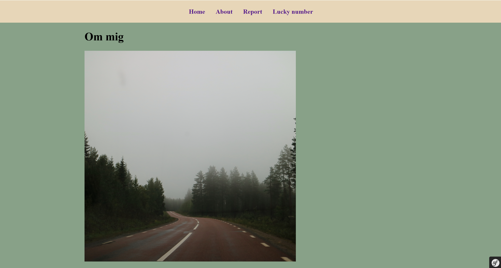

# Introduktion

Detta projekt är en del av MVC-kursen inom Webbprogrammering på Blekinge Tekniska Högskola.

# Klona repository

För att köra programmer lokalt på din dator behöver du klona repot och det gör du genom att köra kommandot: git clone https://github.com/ShirinAjou/mvc

# Kom igång

Därefter behöver du PHP, Symfony och Composer.

1.  Skapa ett Symfony-projekt:
```
composer create-project symfony/skeleton:"7.2.*" app
cd app
```

2. Ladda ner composer: 

```
composer require webapp
```

3. För att starta servern kan du använda följande kommando:

```
symfony server:start
```